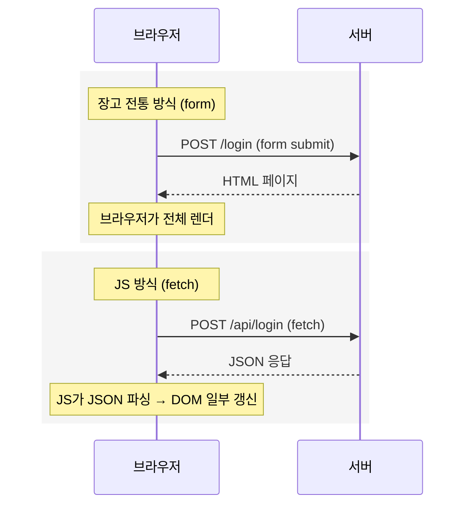
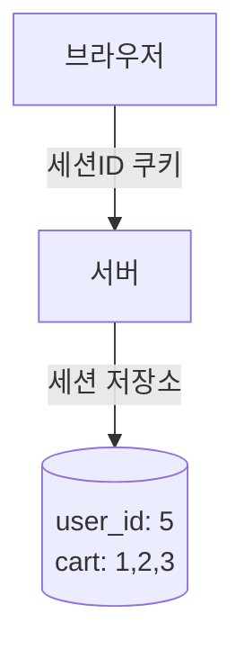
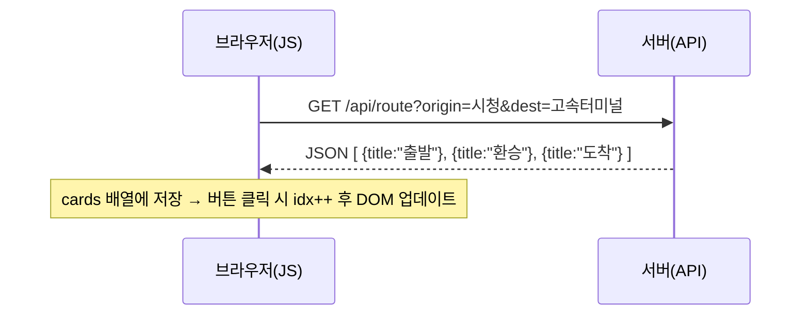
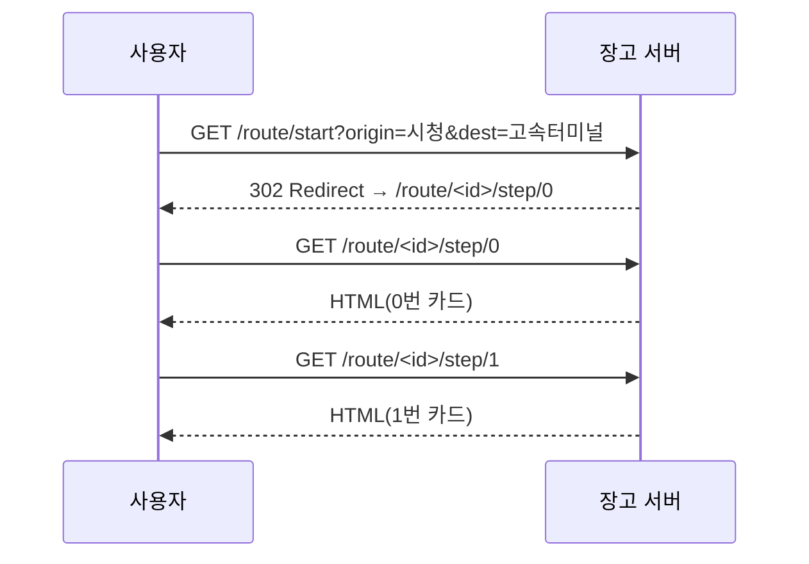

## 1. 자바스크립트란 무엇인가

- 자바스크립트는 **브라우저 안에서 DOM(Document Object Model)을 조작**하는 언어임
- **DOM**: HTML 문서를 브라우저가 객체 트리로 바꾼 것
    - `<div id="result">` → JS에서 `document.querySelector('#result')`로 접근 가능
    - DOM은 **화면의 살아있는 HTML 객체**임
- JS는 `fetch`로 서버에 GET/POST 요청을 보낼 수 있음

👉 DOM 조작 필요 vs 불필요

- **필요**: 채팅창 새 메시지만 추가, 좋아요 숫자만 변경
- **불필요**: 글 작성 후 리스트 페이지로 이동, 로그인 후 마이페이지 이동

---

## 2. 자바스크립트와 장고의 HTTP 요청 방식 (개정)

- **자바스크립트**: `fetch(url, options)` 로 **클라이언트(JS)가 주도**하여 HTTP 요청을 보냄.
    - 응답(JSON/텍스트 등)을 **브라우저가 즉시 렌더하지 않음** → **JS가 받아서 DOM 일부만 갱신**함.
- **장고(전통 방식)**: `<form method="GET/POST" action="/path/">` 같은 **HTML 폼 제출**로 **브라우저가 주도**하여 HTTP 요청을 보냄.
    - 서버가 반환한 **HTML 전체를 브라우저가 새로 렌더**함(페이지 이동/새로고침).

👉 **공통점**: 둘 다 결국 **HTTP 요청/응답**임.

👉 **차이점**: 응답을 누가 처리하느냐

- 폼 제출: 브라우저가 처리(전체 페이지 새 렌더)
- fetch: JS가 처리(부분 DOM 갱신)



---

## 5. 자바스크립트의 이점

- 새로고침 없이 화면 일부만 바꿀 수 있음
- 모바일 앱/SPA와 같이 프론트-백 분리 구조에 필수
- 비동기 통신으로 UX 개선
- 하지만 장고 전통 방식은 **SEO/접근성/안정성** 면에서 강력함

---

## 6. 세션(Session) – 서버가 상태를 기억하는 방식

- HTTP는 기억력이 없음(stateless)
- 세션: 서버에 상태 저장, 브라우저엔 세션ID만 쿠키로 보관
- 로그인, 장바구니, 경로 안내 등에 활용



---

## 7. JS 방식에서의 상태 관리

- JS 방식(SPA/AJAX)은 서버에서 **JSON만 응답**을 받음
- 상태(cards, 로그인 정보 등)를 **브라우저 메모리나 localStorage**에 들고 있음
- 페이지 이동 없이 **JS가 직접 DOM을 갱신**함



---

## 7-1. 세션 vs 메모리(스토리지)

- **JS 메모리/Storage** = 종이 쪽지에 경로 적어서 내가 들고 다님
    
    → 새로고침하면 쪽지 잃어버리거나, 다른 사람이 쪽지 훔칠 수 있음
    
- **서버 세션** = 식당 보관함에 맡기고 보관증(세션ID)만 들고 다님
    
    → 새로고침해도 서버가 기억하고 있고, 보안도 상대적으로 안전함
    

👉 우리 프로젝트(경로 안내 카드)는 새로고침/재접속 시에도 상태가 유지되어야 하므로 **서버 세션이 더 안정적**임

---

## 8. 장고 vs 자바스크립트 방식 비교

| 관점 | 자바스크립트 방식 | 장고 전통 방식 |
| --- | --- | --- |
| 상태 저장 | 브라우저 (메모리/Storage) | 서버 (세션/DB) |
| 화면 전환 | 무재로딩(DOM 갱신) | 페이지 이동(서버 렌더링) |
| 서버 역할 | JSON만 제공(API) | HTML 렌더링 제공 |
| 구현 난이도 | JS 로직 필요, UX 유연 | 단순·견고, SEO/URL 명확 |
| 네트워크 | 필요 시 fetch | 링크/폼/리다이렉트 |

---

## 9. 우리 프로젝트 카드 섹션 탭: 왜 장고 전통 방식인가

### 결론

- 경로 안내 = 순차적 카드 이동
- 각 스텝이 **독립된 URL**로 있어도 문제 없음
- 따라서 **장고 전통 방식(서버 렌더링 + 세션 저장)**이 단순하고 안정적임



### (A) 세션 활용 코드 예시

```python
# views.py
import uuid
from django.shortcuts import render, redirect, get_object_or_404

def start_route(request):
    origin = request.GET.get("origin", "시청")
    dest   = request.GET.get("dest", "고속터미널")
    cards = [
        {"title": "출발", "desc": f"{origin} 승차"},
        {"title": "환승", "desc": "강남역 환승"},
        {"title": "도착", "desc": f"{dest} 하차"},
    ]
    route_id = str(uuid.uuid4())
    routes = request.session.get('routes', {})
    routes[route_id] = cards
    request.session['routes'] = routes
    return redirect('route-step', route_id=route_id, idx=0)

def route_step(request, route_id, idx):
    routes = request.session.get('routes', {})
    cards = routes.get(route_id)
    if not cards or not (0 <= idx < len(cards)):
        return redirect('route-start')
    card = cards[idx]
    return render(request, 'route/step.html', {
        'card': card,
        'idx': idx,
        'has_next': idx < len(cards)-1,
        'route_id': route_id,
    })

```

### (B) 메모리(fetch) 사용 예시

> 같은 기능을 JS 상태 기반으로 구현하면 이렇게 됨(페이지 이동 없음, DOM만 갱신함)
> 

```html
<!-- index.html -->
<form id="routeForm">
  출발 <input name="origin" value="시청" />
  도착 <input name="dest" value="고속터미널" />
  <button>안내 시작</button>
</form>

<div id="card" style="margin-top:16px;"></div>
<div id="nav" style="display:none;gap:8px;margin-top:8px;">
  <button id="prevBtn">← 이전</button>
  <button id="nextBtn">다음 →</button>
</div>

<script>
  const $ = (s) => document.querySelector(s);
  const cardBox = $('#card');
  const nav = $('#nav');
  const prevBtn = $('#prevBtn');
  const nextBtn = $('#nextBtn');

  let cards = [];  // JS 메모리(또는 localStorage)로 상태 보관
  let idx = 0;

  function render() {
    if (!cards.length) return;
    const c = cards[idx];
    cardBox.innerHTML = `
      <h3>${c.title}</h3>
      <p>${c.desc}</p>
      <small>${idx + 1} / ${cards.length}</small>
    `;
    nav.style.display = 'flex';
    prevBtn.disabled = idx === 0;
    nextBtn.disabled = idx === cards.length - 1;
  }

  $('#routeForm').addEventListener('submit', async (e) => {
    e.preventDefault();
    const fd = new FormData(e.currentTarget);
    const origin = fd.get('origin');
    const dest = fd.get('dest');

    // 서버에서 JSON만 받는 경우(API):
    // const res = await fetch(`/api/route?origin=${encodeURIComponent(origin)}&dest=${encodeURIComponent(dest)}`);
    // cards = await res.json();

    // 데모: 클라이언트에서 직접 생성
    cards = [
      { title: '출발', desc: `${origin} 승차` },
      { title: '환승', desc: '강남역 환승' },
      { title: '도착', desc: `${dest} 하차` },
    ];
    idx = 0;
    render();
  });

  prevBtn.addEventListener('click', () => { if (idx > 0) { idx--; render(); } });
  nextBtn.addEventListener('click', () => { if (idx < cards.length - 1) { idx++; render(); } });
</script>

```

- 장점: **무재로딩 전환**, 부분 업데이트 가능
- 단점: **새로고침 시 상태 유실**(메모리에만 있을 경우), 보안/신뢰성은 서버 세션 대비 약함

---

### 정리

- 우리가 원하는 건 순차 카드 안내 + URL 명확 + 새로고침/재접속에도 상태 유지임
- 따라서 **서버 세션 기반(장고 전통 방식)** 이 기본값으로 적합함